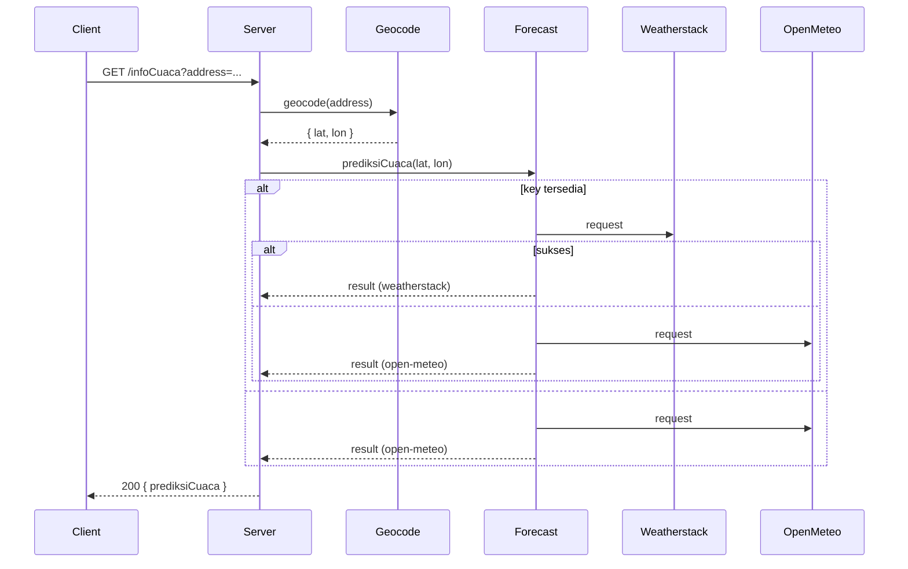

# Strato Nimbus

Strato Nimbus adalah aplikasi web edukasional untuk mengecek kondisi cuaca secara cepat.

## Ringkasan
- Aplikasi mencari koordinat dari alamat (geocoding), lalu mengambil data cuaca dari layanan eksternal.
- Provider utama: Weatherstack (optional, memerlukan API key).
- Fallback: Open‑Meteo (tanpa API key).
- Server dibangun dengan Express dan Handlebars (`hbs`).

## Cara menjalankan (pengembangan)
1. Pasang dependensi:
   ```powershell
   npm install
   ```
2. (Opsional) Set API key Weatherstack untuk menggunakan provider utama:
   ```powershell
   $env:WEATHERSTACK_KEY = 'masukkan_api_key_anda'
   ```
3. Jalankan server:
   ```powershell
   npm run start
   ```
4. Buka browser:
   - Halaman utama: http://localhost:4000/
   - Halaman bantuan: http://localhost:4000/bantuan
   - Halaman tentang: http://localhost:4000/tentang
   - Endpoint API: http://localhost:4000/infoCuaca?address=Jakarta

## Konsep Clean Code yang diterapkan (ringkasan dalam Bahasa Indonesia)
- Hindari menyimpan kunci/rahasia di kode sumber; baca dari variabel lingkungan (`WEATHERSTACK_KEY`).
- Konsistensi nama variabel, komentar, dan struktur file untuk keterbacaan.
- Ekstrak "magic values" (contoh: TTL cache) sebagai konstanta di modul terkait.
- Tangani error eksternal dengan fallback dan pesan yang jelas untuk pengguna.
- Gunakan caching singkat untuk mengurangi risiko rate limit.
- Simpan styling di berkas CSS (hindari inline style bila memungkinkan).

## Perluasan yang direkomendasikan
- Tambahkan ESLint dan konfigurasinya, jalankan autofix, dan perbaiki masalah yang tersisa.
- Tambahkan tes unit untuk `geocode` dan `prediksiCuaca`.
- Tambahkan `.env.example` untuk membantu pengaturan variabel lingkungan.

## Testing & linting
- Jalankan tes unit (Jest):
   ```powershell
   npm test
   ```
- Jalankan ESLint autofix:
   ```powershell
   npm run lint
   ```

Catatan: Pada Windows, skrip `test` menambahkan `NODE_OPTIONS=--experimental-vm-modules` secara otomatis untuk memungkinkan test menggunakan dynamic import ketika diperlukan.

## Arsitektur Singkat

Strato Nimbus dirancang sebagai aplikasi web server kecil yang mengikuti alur RESTful sederhana. Berikut ringkasan arsitektur dan komponen inti:

- Client (browser) — mengirim permintaan ke endpoint internal: `/infoCuaca?address=...`.
- Server Express — menerima request, memanggil utilitas `geocode` untuk mengonversi alamat ke koordinat, lalu memanggil utilitas `prediksiCuaca`.
- `geocode` — menggunakan Photon (komoot) untuk memetakan alamat -> { latitude, longitude, location } dan menerapkan cache in-memory singkat.
- `prediksiCuaca` — mencoba provider utama (Weatherstack) bila `WEATHERSTACK_KEY` tersedia; jika gagal atau tidak ada key, menggunakan Open‑Meteo sebagai fallback. Fungsi ini juga menerapkan cache in-memory untuk mengurangi permintaan berulang.

Gambaran visual (diagram RESTful) ada di: `public/img/RESTful API.png`

Untuk dokumentasi lebih lengkap tentang alur, kontrak endpoint, dan rekomendasi produksi, lihat `docs/ARCHITECTURE.md`.

### Diagram ringkas (preview)

Jika viewer Anda mendukung Mermaid, lihat `docs/ARCHITECTURE.md` untuk diagram lengkap. Berikut adalah preview ringkas yang juga ditampilkan sebagai gambar SVG bila renderer tidak mendukung Mermaid:



