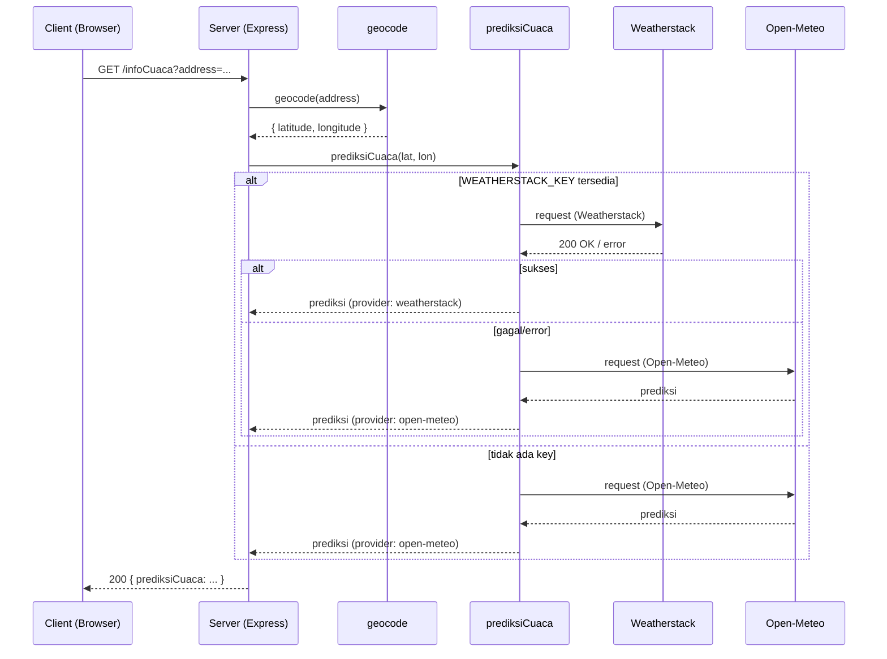

# Arsitektur Strato Nimbus (ringkasan teknis)

Dokumen ini menjelaskan alur permintaan, komponen utama, kontrak data, mode error, dan rekomendasi produksi untuk aplikasi Strato Nimbus.

## Komponen utama

- Client (browser)
  - Mengirimkan permintaan GET ke endpoint internal `GET /infoCuaca?address=<alamat>`.
- Server (Express)
  - Router menerima query `address`, memanggil utilitas `geocode` lalu `prediksiCuaca`, dan mengembalikan JSON terstruktur.
- Utilitas `geocode` (`src/utils/geocode.js`)
  - Provider: Photon (komoot) public geocoding API.
  - Output: { latitude: number, longitude: number, location: string }
  - Cache: in-memory Map; TTL default 10 menit; negative cache untuk error (short TTL).
- Utilitas `prediksiCuaca` (`src/utils/prediksiCuaca.js`)
  - Provider utama: Weatherstack (opsional, memerlukan `WEATHERSTACK_KEY`).
  - Fallback: Open‑Meteo (tanpa API key).
  - Output: objek `prediksiCuaca` dengan fields yang distandarisasi (lihat bagian "Kontrak Endpoint").
  - Cache: in-memory Map; TTL default 10 menit; negative cache untuk error (short TTL).

## Alur permintaan (sequence)

1. Client -> Server: GET /infoCuaca?address=Jakarta
2. Server -> geocode(address): memanggil Photon, mengembalikan koordinat
3. Server -> prediksiCuaca(lat, lon):
   - Jika `WEATHERSTACK_KEY` tersedia: coba Weatherstack
   - Jika Weatherstack gagal (HTTP error, 4xx/5xx, atau response.error), fallback ke Open‑Meteo
4. prediksiCuaca mengembalikan objek terstruktur
5. Server merespons JSON ke client

Diagram singkat (gambar tersemat tersedia di `public/img/RESTful API.png`).

## Diagram Alur (Mermaid)

Jika viewer Markdown Anda mendukung Mermaid, diagram berikut menunjukkan alur utama dan fallback provider:

Gambar diagram juga tersedia sebagai file raster di `public/img/RESTful API.png` jika renderer Anda tidak mendukung Mermaid.

## Kontrak Endpoint `/infoCuaca`

Response (200 OK) JSON:

{
  "prediksiCuaca": {
    "deskripsi": string | null,
    "temperature": number | null,
    "wind_speed": number | null,
    "visibility": number | null, // dalam km bila tersedia
    "humidity": number | null,   // persen
    "pressure": number | null,   // hPa
    "uv_index": number | null,
    "icon": string | null,       // unicode emoji atau URL (provider)
    "raw": object,              // payload mentah dari provider
    "provider": "weatherstack" | "open-meteo"
  }
}

Error modes umum:
- 400 Bad Request — parameter `address` hilang atau kosong.
- 500 Internal Server Error — kegagalan internal yang tidak tertangani.
- 502/503 — jika upstream provider sama-sama gagal (jarang karena fallback Open‑Meteo).

## Kontrak internal / variabel penting

- `WEATHERSTACK_KEY` (env) — jika ada, aplikasi mencoba Weatherstack terlebih dahulu.
- TTL cache (konstanta di utilitas):
  - DEFAULT_TTL = 10 menit (600000 ms)
  - ERROR_TTL = 1 menit (60000 ms)

## Praktik produksi yang direkomendasikan

1. Jangan gunakan cache in-memory untuk lingkungan multi-instance. Gunakan Redis atau store terdistribusi.
2. Tambahkan circuit-breaker atau exponential backoff saat memanggil provider berbayar untuk melindungi kuota.
3. Simpan kunci API di layanan rahasia (secrets manager) atau file `.env` yang tidak dikomit.
4. Implementasikan monitoring pada endpoint utama (`/infoCuaca`) dan metrik untuk latensi dan tingkat fallback (berapa sering Open‑Meteo dipakai).
5. Batasi rate pada endpoint publik (rate limiting per IP) untuk mencegah spam/abuse.

## Tes dan linting

- Unit tests: `tests/*.test.cjs` (menggunakan Jest). Tes mock `global.fetch` sehingga tidak melakukan panggilan jaringan.
- Linting: ESLint (konfigurasi ada di `.eslintrc.cjs`). Jalankan `npm run lint` untuk autofix sederhana.

## Catatan terakhir

Desain ini memprioritaskan keandalan untuk tugas praktikum: fallback provider, negative caching, dan pesan error yang jelas. Untuk produksi, terapkan store cache terpusat dan kelola kredensial API dengan aman.
